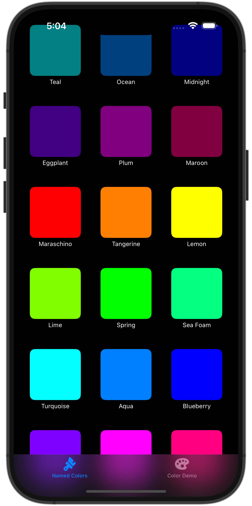
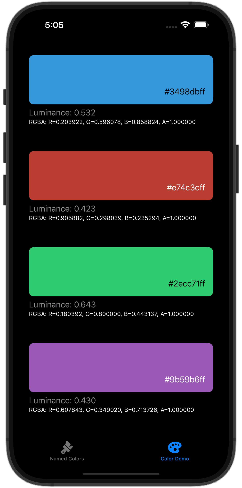

# ColorKitDemo

**ColorKitDemo** is a SwiftUI sample application demonstrating the features of the [ColorKit](https://github.com/ironcook67/ColorKit) Swift Package. It showcases how to use colors defined by hexadecimal strings, view color properties, and browse named colors.

## Features

- Display and interact with colors initialized from hex strings.
- View color information including RGBA values and luminance.
- Browse a list of named colors.
- Explore how `ColorKit` integrates with SwiftUI views.

## Screenshots

  
  

## Installation
This application is part of the ColorKit project. To run this demo, you need to clone the repository and open it in Xcode and ensure [ColorKit](https://github.com/ironcook67/ColorKit) is added via Swift Package Manager.

## Usage

Run the app in the simulator or on a device to explore the color utilities in action. Use the provided interface to test different hex values and observe real-time color previews and metrics.

## License

MIT License.

Copyright (c) 2025 Chon Torres.

Permission is hereby granted, free of charge, to any person obtaining a copy of this software and associated documentation files (the "Software"), to deal in the Software without restriction, including without limitation the rights to use, copy, modify, merge, publish, distribute, sublicense, and/or sell copies of the Software, and to permit persons to whom the Software is furnished to do so, subject to the following conditions:

The above copyright notice and this permission notice shall be included in all copies or substantial portions of the Software.

THE SOFTWARE IS PROVIDED "AS IS", WITHOUT WARRANTY OF ANY KIND, EXPRESS OR IMPLIED, INCLUDING BUT NOT LIMITED TO THE WARRANTIES OF MERCHANTABILITY, FITNESS FOR A PARTICULAR PURPOSE AND NONINFRINGEMENT. IN NO EVENT SHALL THE AUTHORS OR COPYRIGHT HOLDERS BE LIABLE FOR ANY CLAIM, DAMAGES OR OTHER LIABILITY, WHETHER IN AN ACTION OF CONTRACT, TORT OR OTHERWISE, ARISING FROM, OUT OF OR IN CONNECTION WITH THE SOFTWARE OR THE USE OR OTHER DEALINGS IN THE SOFTWARE.
