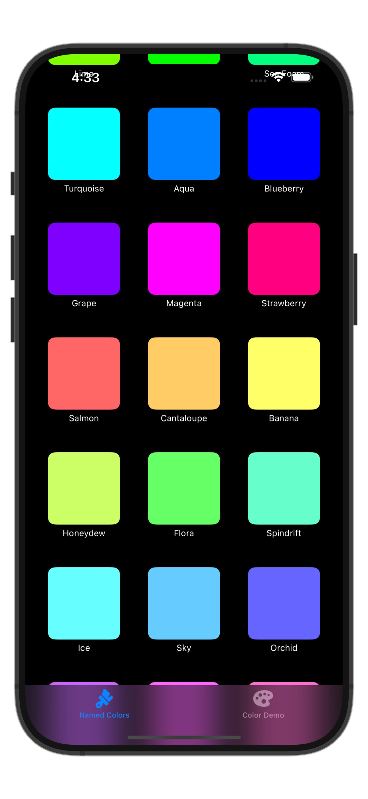
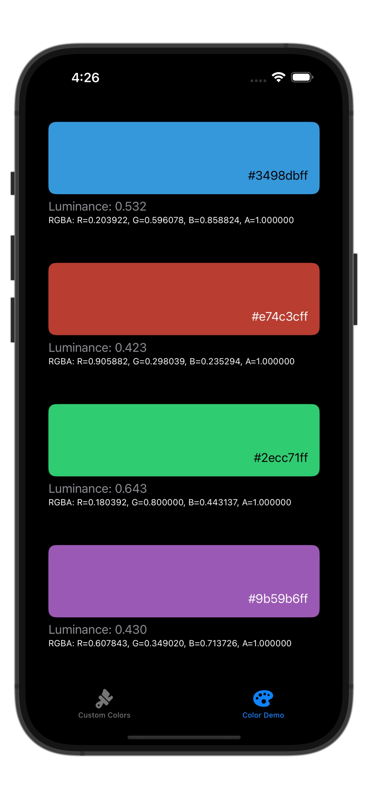

# ColorKitDemo

**ColorKitDemo** is a SwiftUI sample application demonstrating the features of the [ColorKit](https://github.com/ironcook67/ColorKit) Swift Package. It showcases how to use colors defined by hexadecimal strings, view color properties, and browse named colors.

## Features

- Display and interact with colors initialized from hex strings.
- View color information including RGBA values and luminance.
- Browse a list of named colors.
- Explore how `ColorKit` integrates with SwiftUI views.

## Screenshots

  
  

## Requirements

- iOS 14.0+ / macOS 11.0+
- Xcode 14+
- Swift 5.7+

## Installation
This application is part of the ColorKit project. To run this demo, you need to clone the repository and open it in Xcode and ensure [ColorKit](https://github.com/ironcook67/ColorKit) is added via Swift Package Manager.

## Usage

Run the app in the simulator or on a device to explore the color utilities in action. Use the provided interface to test different hex values and observe real-time color previews and metrics.

## License

This project is licensed under the MIT License.
